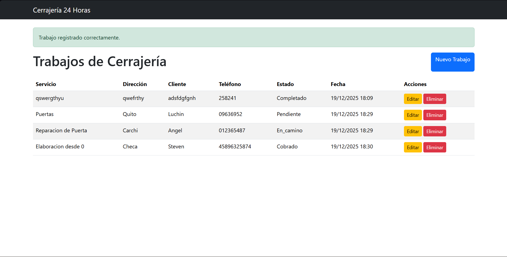
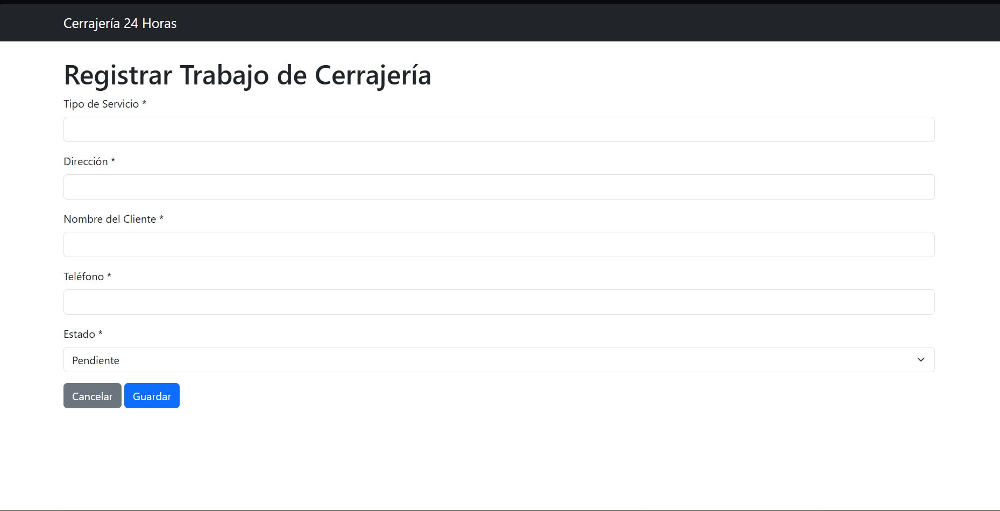
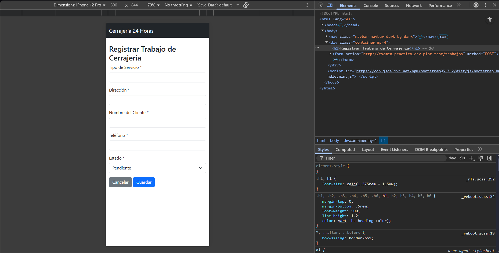

# Caso 19 – Cerrajería 24 Horas

Proyecto desarrollado en Laravel como parte del examen práctico de la asignatura.  
El sistema implementa un módulo CRUD para la gestión de trabajos de una cerrajería, pensado para su uso principal desde dispositivos móviles.

---

## 📌 Descripción del Caso

Luis es cerrajero y recibe llamadas constantemente para realizar trabajos.  
Anteriormente registraba la información en una libreta, lo que ocasionaba pérdida de datos al no tenerla siempre a mano.

Este sistema permite registrar y gestionar los trabajos de forma digital, evitando pérdidas de información y facilitando el seguimiento de cada servicio.

---

## ⚙️ Funcionalidades Implementadas

El sistema permite:

- Registrar trabajos con:
  - Tipo de servicio
  - Dirección
  - Nombre del cliente
  - Teléfono
  - Estado del trabajo (pendiente, en camino, completado, cobrado)
- Registrar automáticamente la fecha y hora del llamado
- Listar todos los trabajos registrados
- Editar trabajos existentes en caso de errores
- Eliminar trabajos de forma lógica (no se eliminan físicamente)
- Visualizar correctamente el sistema desde dispositivos móviles

---

## 🧠 Decisiones de Diseño

- **Eliminación lógica (Soft Deletes):**  
  Los trabajos no se eliminan definitivamente de la base de datos para permitir su posterior revisión o uso en procesos de facturación.

- **Estados controlados mediante ENUM:**  
  Se definieron estados específicos para asegurar consistencia en el flujo de los trabajos.

- **Diseño responsive:**  
  Se utilizó Bootstrap para garantizar una correcta visualización en celulares, considerando que el usuario principal trabaja en la calle.

- **CRUD completo usando Laravel Resource Controllers:**  
  Se utilizó la estructura estándar de Laravel para mantener el código organizado y claro.

---

## 🧩 Tecnologías Utilizadas

- Laravel 12
- PHP 8.4
- MySQL
- Blade Templates
- Bootstrap 5

---

## 🗂 Estructura Principal

- **Modelo:** `Trabajo`
- **Controlador:** `TrabajoController`
- **Rutas:** `Route::resource('trabajos', TrabajoController::class)`
- **Vistas:**  
  - `trabajos/index.blade.php`  
  - `trabajos/create.blade.php`  
  - `trabajos/edit.blade.php`  

---

## 📸 Capturas de Pantalla

El proyecto incluye las siguientes vistas principales del sistema:

### 1. Vista de listado de trabajos
Muestra todos los trabajos registrados con su información básica (cliente, servicio, estado y fecha), permitiendo una gestión rápida desde el celular o escritorio.

### 2. Formulario de creación de un trabajo
Formulario para registrar un nuevo trabajo de cerrajería, ingresando datos como tipo de servicio, dirección, nombre del cliente y teléfono. La fecha se genera automáticamente.

### 3. Vista en modo móvil (responsive)
Interfaz adaptada para dispositivos móviles, pensada para que el cerrajero pueda usar el sistema cómodamente desde la calle.

---

## 🔗 Repositorio del Proyecto

El código fuente del proyecto se encuentra disponible en GitHub en el siguiente enlace:

👉 [https://github.com/](https://github.com/StevenAJ23/Examen-Practico-Dev-Plataformas)
--

## 👨‍💻 Autor

  <strong>Steven Ariel Rosero</strong> 
  <em>Haciendo que el sistema funcione, a base de fe y café ☕</em> 
  Estudiante de Ingeniería en Sistemas 
  Pontificia Universidad Católica del Ecuador

